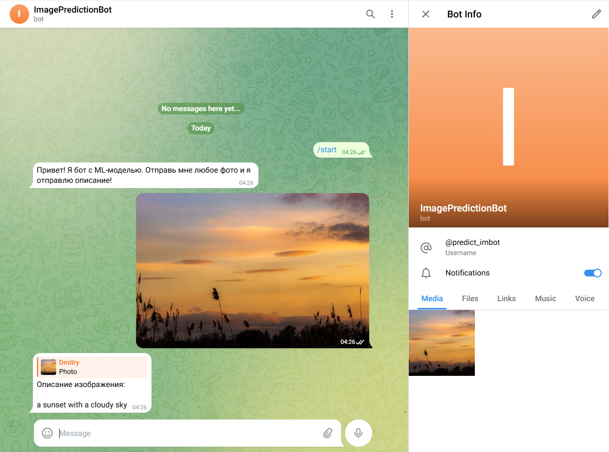
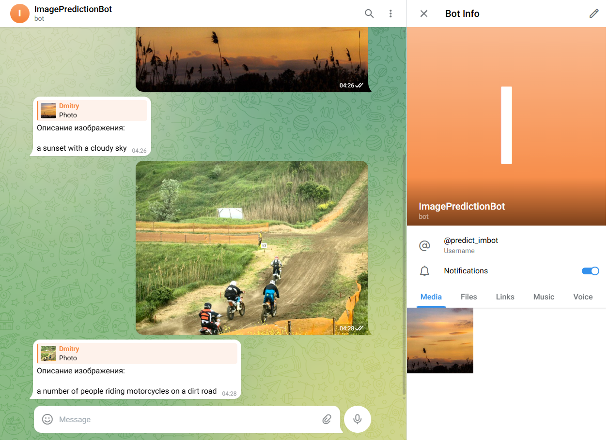
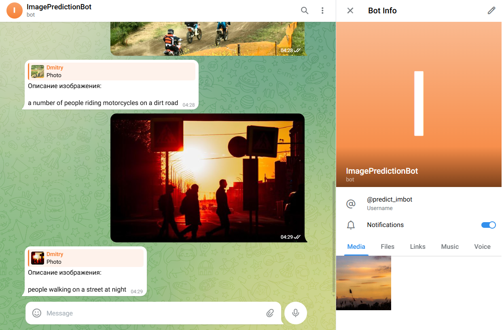

# Telegram Bot и генеративные модели Hugging Face
Приложение для запуска телеграмм бота, который генерирует описание по картинке

Используемая модель: nlpconnect/vit-gpt2-image-captioning

# Установка
## 1. Склонировать и перейти в репозиторий
```
git clone https://github.com/dmitryeskov/tg_ai_bot.git
```
## 2. Установить необходимые зависимости
```
pip install -r requirements.txt
```
## 3. Конфигурация
Создать файл .env с переменной API_TOKEN для доступа к боту
```
#.env

API_TOKEN=your_tg_bot_api_token
```
# Запуск
После создания .env файла с токеном доступа запустить бота
```
python main.py
```

# Результаты работы
# Фото №1


Ответ:

```
Описание изображения:

a sunset with a cloudy sky
```

# Фото №2


Ответ:

```
Описание изображения:

a number of people riding motorcycles on a dirt road
```

# Фото №3


Ответ:

```
Описание изображения:

people walking on a street at night
```